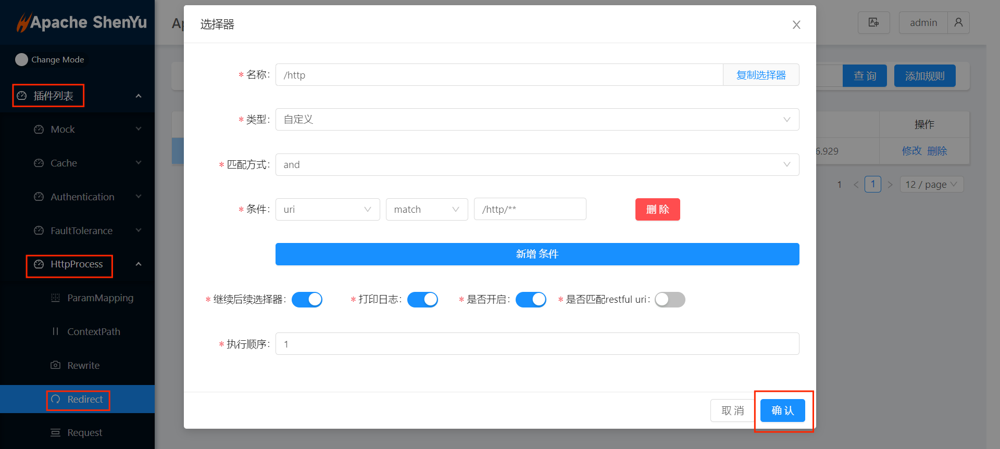

# 1. 概述

## 1.1 插件名称
- Redirect(重定向)插件

## 1.2 适用场景
- 顾名思义，`Redirect` 插件就是对 `uri` 的重新转发和重定向。

## 1.3 插件功能
- Apache ShenYu 网关在对目标服务进行代理调用的时候，允许用户使用 `Redirect` 插件来重定向请求。

## 1.4 插件代码
- 核心模块 ```shenyu-plugin-context-redirect```
- 核心类 ```org.apache.shenyu.plugin.redirect.RedirectPlugin```

## 1.5 添加自哪个 shenyu 版本
- 2.2.0 版本以前。

# 2. 如何使用插件

## 2.1 插件使用流程图


## 2.2 导入 pom
- 在网关的 `pom.xml` 文件中添加插件 maven 配置。
```xml
  <!-- apache shenyu redirect plugin start-->
  <dependency>
      <groupId>org.apache.shenyu</groupId>
      <artifactId>shenyu-spring-boot-starter-plugin-redirect</artifactId>
     <version>${project.version}</version>
  </dependency>
  <!-- apache shenyu redirect plugin end-->
```

## 2.3 启用插件
- 在 `shenyu-admin` --> 基础配置 --> 插件管理 --> `redirect` 设置为开启。

  

## 2.4 配置插件
- 选择器和规则，只有匹配的请求，才会进行转发和重定向，请参考：[选择器规则管理](../../user-guide/admin-usage/selector-and-rule)。
- `shenyu-admin`插件列表 --> `HttpProcess` --> `Redirect`，先添加选择器，然后添加规则：
- 添加选择器：

  

- 添加规则：

  

## 2.5 示例

### 2.5.1 重定向
- 我们在 `规则` 配置自定义路径时，应该为一个可达的服务路径。
- 当匹配到请求后，根据自定义的路径，`Apache ShenYu`网关会进行 `308` 服务跳转。
1. 参考[本地部署](https://shenyu.apache.org/zh/docs/deployment/deployment-local)启动 admin 和网关
2. 参考2.2导入 pom 并重启网关
3. 参考2.3启用插件
4. 参考2.4及[选择器规则管理](../../user-guide/admin-usage/selector-and-rule)配置插件规则
5. 接口调用：[示例接口调用](http://localhost:9195/http)
- 调用选择器和规则声明的接口，将会重定向至指定路径。
- 在本例中，将跳转至[ ShenYu 官网](https://shenyu.apache.org)

  

### 2.5.2 网关自身接口转发
- 当满足匹配规则时，服务内部会使用 `DispatcherHandler` 内部接口转发。
- 要实现网关自身接口转发，我们需要在配置路径使用 `/` 作为前缀开始，具体配置如下图。

  

# 3. 如何禁用插件
- 在 `shenyu-admin` --> 基础配置 --> 插件管理 --> `Redirect` 设置为禁用。
  
  
