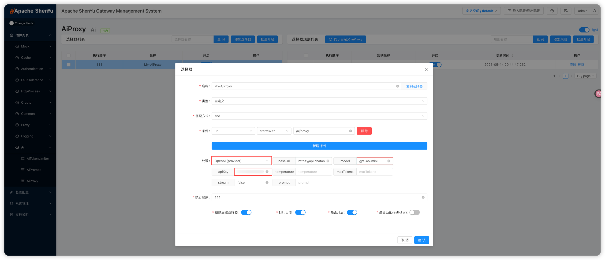
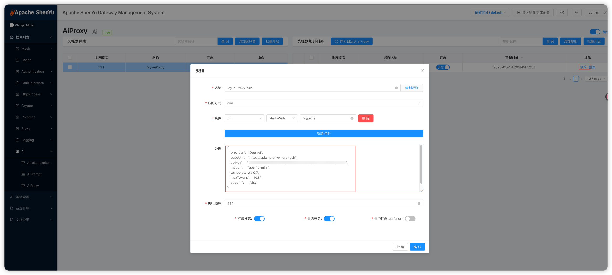
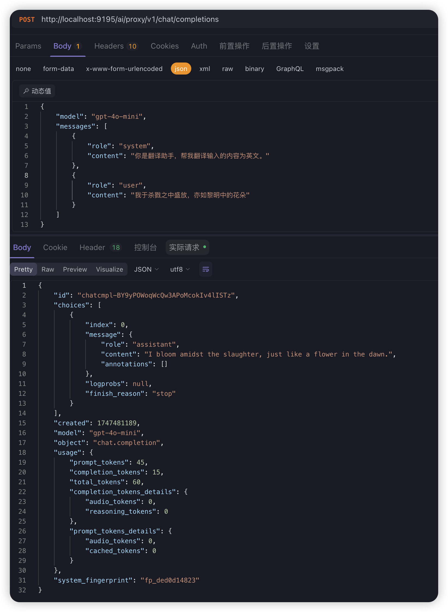

## 说明

aiProxy 插件用作 LLM 请求的转发代理，支持主流大模型服务。用户通过 ShenYu 将请求发送到配置了 aiProxy 的路由，aiProxy 会根据插件配置的提供商（如 OpenAI、阿里云等）、模型名称、API 密钥等参数，调用对应 LLM 的 API 并返回结果。典型应用场景包括将聊天请求转发给 OpenAI 的 ChatGPT 接口，或使用国内的 AI 服务进行智能问答。类比之前的插件使用模式， 可以理解为LLM扮演了原有应用服务的角色， 本地模型兼容OpenAI协议或其他主流协议的话， 也可以通过shenyu-aiProxy插件进行代理。

## 插件设置

在 ShenYu 管理界面配置插件时，需要先创建 **Selector**（选择器）再创建 **Rule**（规则）。Selector 通常用于匹配请求条件（如路径、Header 等），Rule 用于配置插件参数或转发目标。关于选择器和规则配置，请参考：[选择器和规则管理](../../user-guide/admin-usage/selector-and-rule)。

使用aiProxy插件主要关注以下字段：

- **Selector**: 选择器通常指定匹配的路径或请求特征。如可设置 `Pattern` 为 `/**` 以匹配所有请求，或指定特定路由路径。

- **Rule**: 在规则层面为各插件填写参数。各插件常见字段如下：

  - `provider：`提供商名，如 OpenAI;
  - `baseUrl:`LLM提供商API 调用地址;
  - `model:` 模型名称;
  - `apiKey:` 授权密钥;

以下给出aiProxy插件的配置示例截图在 （admin 界面）：

Selector 匹配路径后，Rule 中配置提供商、模型、API Key、上游地址等参数。





注意， 在该设置下， 还需要进行contextPath插件的设置， 以移除匹配前缀头， 拼接正确调用url， 请参考：[contextPath插件设置](../http-process/contextPath-plugin.md)


## API调用说明

启用AiProxy插件后， 通过postman等工具请求shenyu网关， 即可通过网关代理获取LLM响应

```bash
curl --location --request POST 'http://localhost:9195/ai/proxy/v1/chat/completions' \
--header 'Content-Type: application/json' \
--data-raw '{
    "model": "gpt-4o-mini",
    "messages": [
        {
            "role": "system",
            "content": "你是翻译助手，帮我翻译输入的内容为英文。"
        },
        {
            "role": "user",
            "content": "我于杀戮之中盛放，亦如黎明中的花朵"
        }
    ]
}'
```

示例截图


